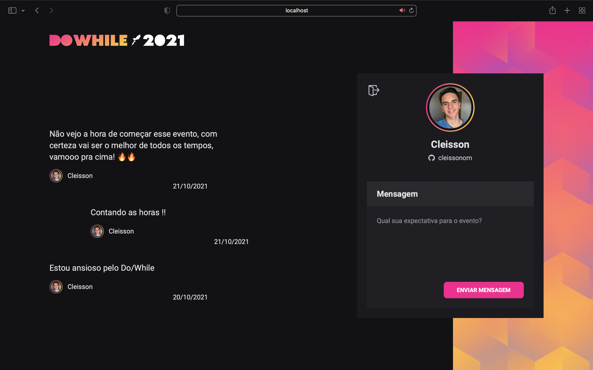

## 📝 FrontEnd / ReactJS

Frontend developed in ReactJS using Vite as ecosystem, so the application has several tools and performance both in compilation and development.

### 💻 Install e Start

- **Install the dependencies**
  `yarn` ou `npm install`

- **Start the project**
  `yarn dev` ou `npm run dev`

### ⚙️ Technologies

- [Vite](https://vitejs.dev)
- [ReactJS](https://reactjs.org)
- [Typescript]()
- [SASS](https://sass-lang.com)
- [Context API](https://reactjs.org/docs/context.html)

More: [React Icons](https://react-icons.github.io/react-icons) / [Axios](https://axios-http.com)

---
